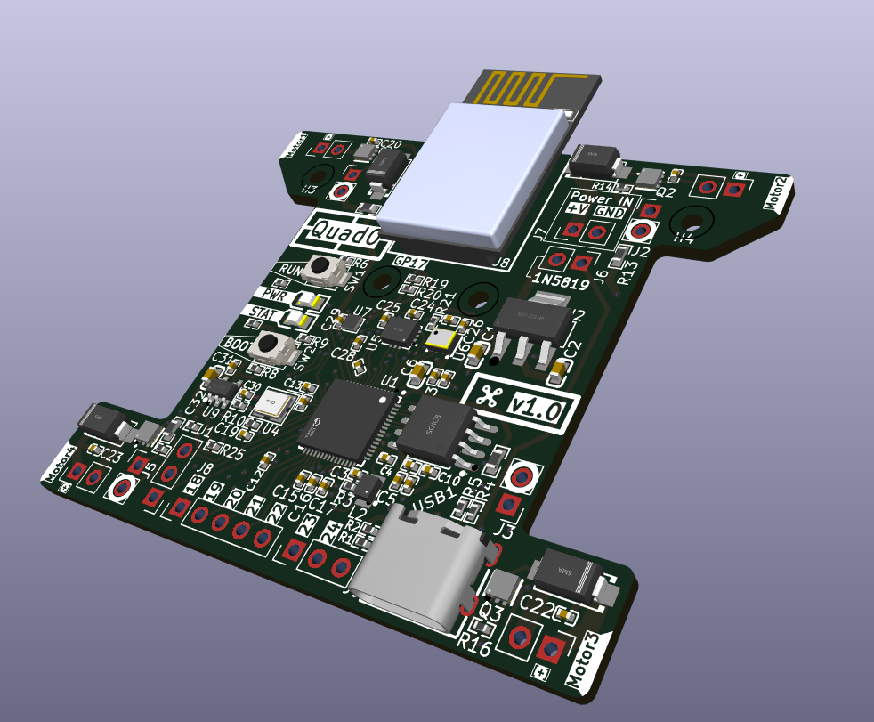
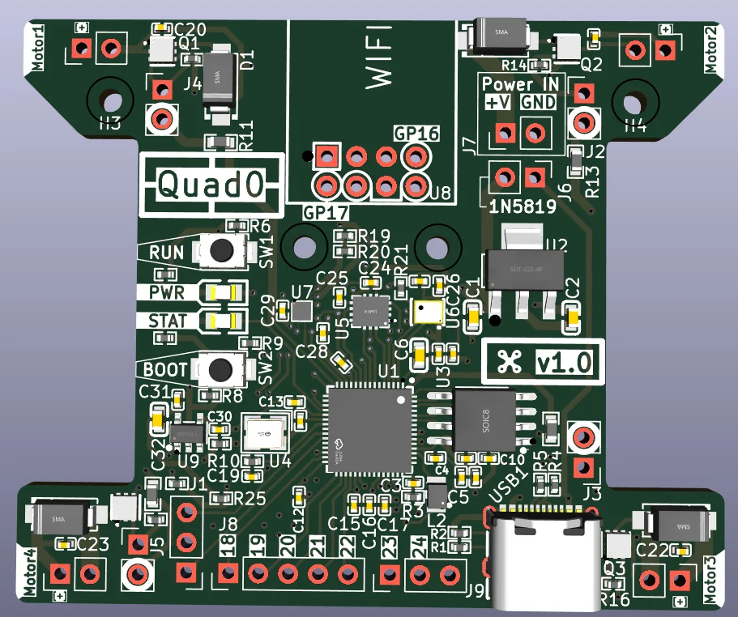
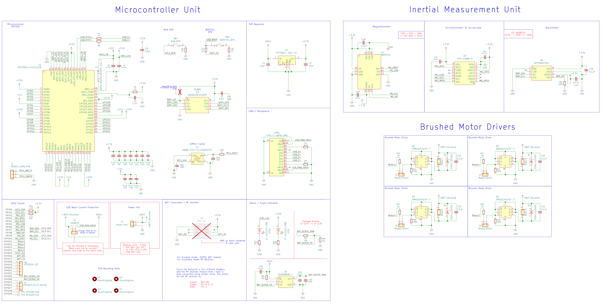

# **Quad0**

*quadcopter with a custom flight controller, firmware that supports both brushed and brushless motors*

## **Design**
This is a custom flight controller with minimal stuff required to fly a quadcopter on-board, supporting both brushless and brushed motors.

Onboard components include:

- `RP2350A` Microcontroller Unit
- **IMU**:
    - `ICM-42688-P` Accelerometer & Gyroscope
    - `DPS368XTSA1` Barometer
    - `BMM150` Magnetometer

- MOSFET motor drivers (`DMN2024UFDF-7`) for brushed motors
- Pads to connect brushed / brushless motors
- Support for `ESP01 WiFi module` for brushed mode OR any radio receiver that supports SBUS or similar protocols for brushless mode

The board will be designed in a way such that it can fly with standard *8520 coreless motors* and a tiny lipo battery for brushed mode.

As for the brushless mode, I will be targeting `2204` size brushless motors with a `5inch` prop size, ~5inch frame configuration.

## **PCB**

The PCB 3D preview looks like this:

## **Schematics**

> *[Right Click >> Open in new tab] on the image to view properly.*

> Note that the PCB and schematic files can be opened using KiCAD. They are located in the `/PCB/Quad0` directory inside this repository.

Steps for viewing the PCB schematics and layout:
- Open KiCAD
- Click **File** (top left) >> **Open Project**
- Navigate to the the repository's saved destination,
- Open **/PCB/Quad0** directory
- Select the file `Quad0.kicad_pro`

## **CAD Frame**

*Work In progress*

Note that the frame will be different for brushed and brushless modes due to weight and size requirements, and I will be designing both myself!

## **Firmware**

*Work In progress*

> *Note that the hardware is [fully supported](https://betaflight.com/blog/2025/10/10/RP2350%20Lands%20in%20Betaflight) by [Betaflight](https://betaflight.com/)*

## 😼💖