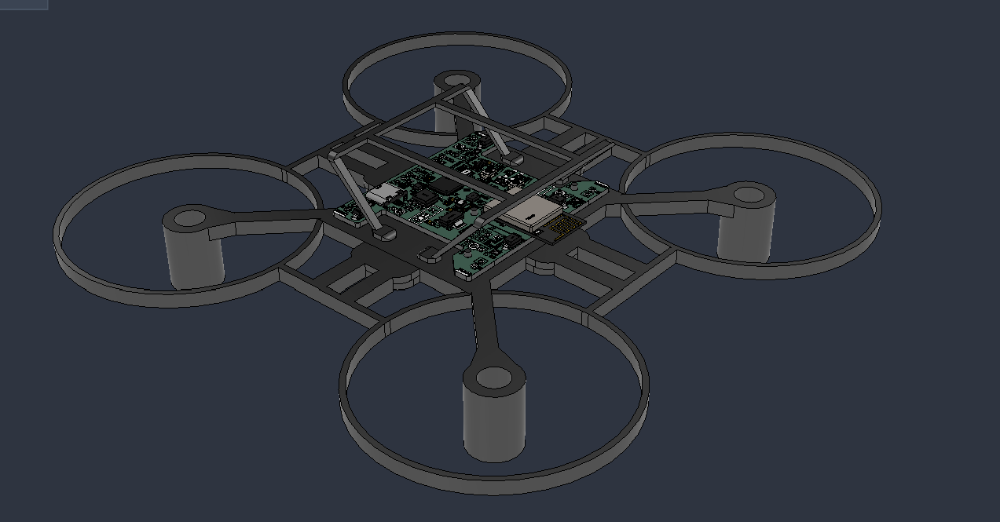
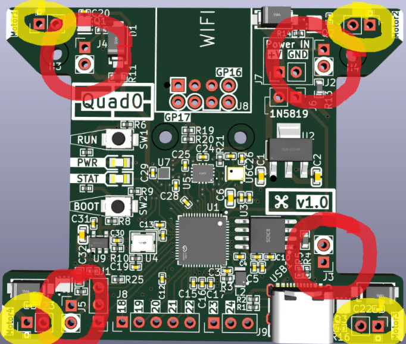
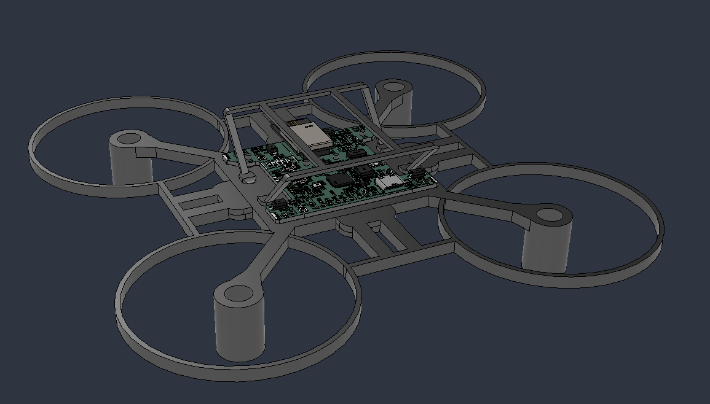
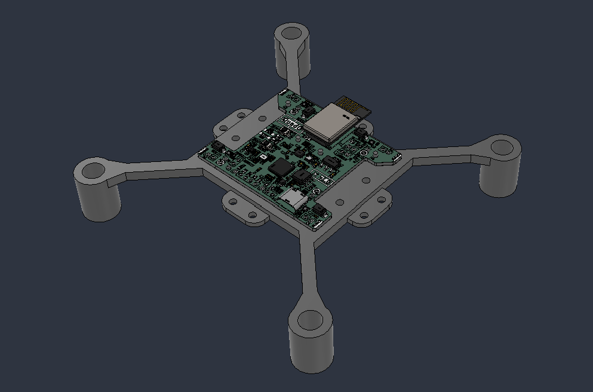
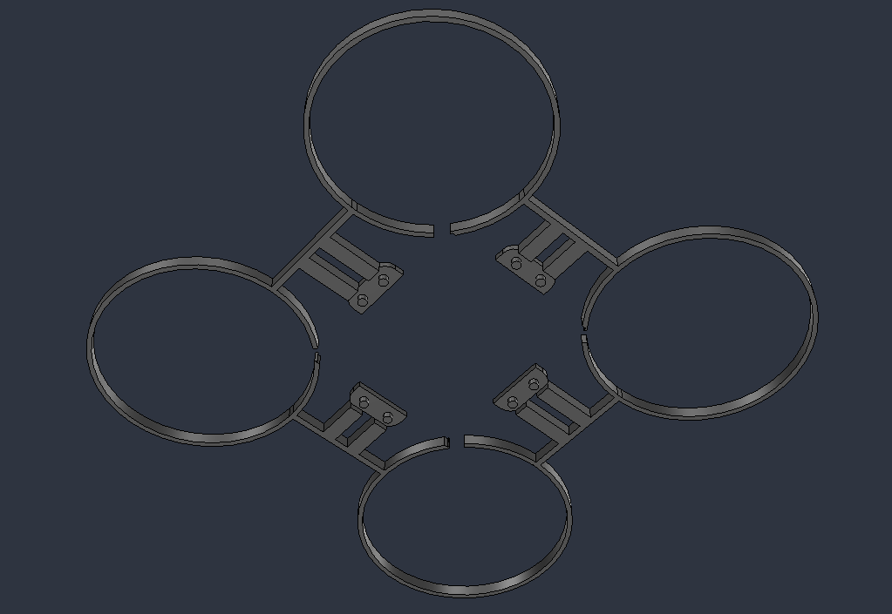
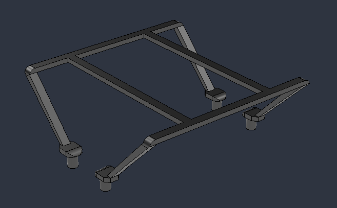

# **Quad0**

*quadcopter with a custom flight controller, firmware that supports both brushed and brushless motors*

## **The Idea**
This is a custom flight controller with minimal stuff required to fly a quadcopter on-board, supporting both brushless and brushed motors.

Onboard components include:

- `RP2350A` Microcontroller Unit
- **IMU**:
    - `ICM-42688-P` Accelerometer & Gyroscope
    - `DPS368XTSA1` Barometer
    - `BMM150` Magnetometer

- MOSFET motor drivers (`DMN2024UFDF-7`) for brushed motors
- Pads to connect brushed / brushless motors
- Support for `ESP01 WiFi module` for brushed mode OR any radio receiver that supports SBUS or similar protocols for brushless mode

The board will be designed in a way such that it can fly with standard *8520 coreless motors* and a tiny lipo battery for brushed mode.

As for the brushless mode, I will be targeting `2204` size brushless motors with a `5inch` prop size, ~5inch frame configuration.

## **PCB**

The PCB 3D preview looks like this:

## **Schematics**

> *[Right Click >> Open in new tab] on the image to view properly.*

> Note that the PCB and schematic files can be opened using KiCAD. They are located in the `/PCB/Quad0` directory inside this repository.

Steps for viewing the PCB schematics and layout:
- Open KiCAD
- Click **File** (top left) >> **Open Project**
- Navigate to the the repository's saved destination,
- Open **/PCB/Quad0** directory
- Select the file `Quad0.kicad_pro`

## Brushed / Brushless Switch

- **Yellow**: Brushed motor connectors
- **Red**: Brushed / Brusheless Mode selection connector

**For Brushed:** Short both pads together using solder or by soldering 2.54mm headers and adding jumper.

**For Brushless:** Un-short both pads if shorted, connect ESC signal pin to the pad marked with the thick white circle.

Each Mode selection connector is placed closest to the motor output it controls.

## **CAD Frame**
> View [/CAD](./CAD/) directory for `.f3d` and `.step` files.

The frame for brushed version of the quadcopter was designed in Fusion360 and looks like this:

**The frame is divided into 3 separate parts:**

- **Main Frame:**

- **Duct Body:**

- **Cover:**

All the parts are made to friction-fit together using cylindrical extrusions and holes, the reason being to minimize the weight of the frame as using screws would add a LOT of weight. The friction fits would allow for either the cover or duct body to be omitted incase they are adding too much weight.

## **Firmware**

*Please checkout the [Firmware/](./Firmware/) directory to view the firmware source, current state and compiling / flashing instructions.*

> Note that the hardware is also [fully supported](https://betaflight.com/blog/2025/10/10/RP2350%20Lands%20in%20Betaflight) by [Betaflight](https://betaflight.com/). Instructions on how to setup betaflight will be provided after I physically test it myself to know what works.

## 😼💖