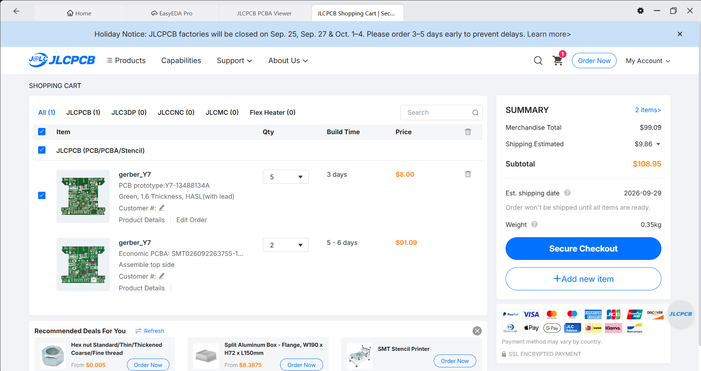

# **Quad0**

*quadcopter with a custom flight controller, firmware that supports both brushed and brushless motors*

## **The Idea**
This is a custom flight controller with minimal stuff required to fly a quadcopter on-board, supporting both brushless and brushed motors.

Onboard components include:

- `RP2350A` Microcontroller Unit
- **IMU**:
    - `ICM-42688-P` Accelerometer & Gyroscope
    - `DPS368XTSA1` Barometer
    - `BMM150` Magnetometer

- MOSFET motor drivers (`DMN2024UFDF-7`) for brushed motors
- Pads to connect brushed / brushless motors
- Support for `ESP01 WiFi module` for brushed mode OR any radio receiver that supports SBUS or similar protocols for brushless mode

The board will be designed in a way such that it can fly with standard *8520 coreless motors* and a tiny lipo battery for brushed mode.

As for the brushless mode, I will be targeting `2204` size brushless motors with a `5inch` prop size, ~5inch frame configuration.

> For building, skip to [Build instructions](#build-instructions) section.

## **PCB**

The PCB 3D preview looks like this:

## **Schematics**

> *[Right Click >> Open in new tab] on the image to view properly.*

> Note that the PCB and schematic files can be opened using KiCAD. They are located in the `/PCB/Quad0` directory inside this repository.

Steps for viewing the PCB schematics and layout:
- Open KiCAD
- Click **File** (top left) >> **Open Project**
- Navigate to the the repository's saved destination,
- Open **/PCB/Quad0** directory
- Select the file `Quad0.kicad_pro`

## Brushed / Brushless Switch

- **Yellow**: Brushed motor connectors
- **Red**: Brushed / Brusheless Mode selection connector

**For Brushed:** Short both pads together using solder or by soldering 2.54mm headers and adding jumper.

**For Brushless:** Un-short both pads if shorted, connect ESC signal pin to the pad marked with the thick white circle.

Each Mode selection connector is placed closest to the motor output it controls.

## **CAD Frame**
> View [/CAD](./CAD/) directory for `.f3d` and `.step` files.

The frame for brushed version of the quadcopter was designed in Fusion360 and looks like this:

**The frame is divided into 3 separate parts:**

- **Main Frame:**

- **Duct Body:**

- **Cover:**

All the parts are made to friction-fit together using cylindrical extrusions and holes, the reason being to minimize the weight of the frame as using screws would add a LOT of weight. The friction fits would allow for either the cover or duct body to be omitted incase they are adding too much weight.

## **Firmware**

*Please checkout the [/Firmware](./Firmware/) directory to view the firmware source, current state and compiling / flashing instructions.*

> Note that the hardware is also [fully supported](https://betaflight.com/blog/2025/10/10/RP2350%20Lands%20in%20Betaflight) by [Betaflight](https://betaflight.com/). Instructions on how to setup betaflight will be provided after I physically test it myself to know what works.

## **Ordering Parts, PCBA**
1. **PCBA**

Files required (gerber, bom, cpl) for ordering PCB Assembly from JLCPCB are available in [PCB/Ordering/](./PCB/Ordering/) directory.

The grand total for this comes out to be at `$108.95`, including `$9.86` for shipping. This cost can be brought down using coupon codes and also using JLCPCB'S desktop app: JLCONE.

This is after minimizing extended components usage and using basic PCBA (cheapest option). The PCB quantity and PCBA quantity is the MOQ (minimum order quantity): 5, 2 respectively.

**Cart Screenshot:**

2. **Other components**

Components required other than the ones that the PCBA covers are the following (for brushed mode):
- 4x Coreless Motors
- 4x 65mm propellers (2CW + 2CCW)
- 1x 1N5819 Diode (6V version recommended)
- 1x 3.7v tiny LiPo battery (+ a charger for it if you do not have one). Recommended capacity ~350-500mAh, try to minimize weight
- 1x ESP-01 WiFi Module
- 2.54mm header pins as required (only if you need them, otherwise you can directly solder the wires to the pads)

### **BOM** (Region: India)
---
| S.No. | Item Name | Item Description | URL | Qty | Unit Price ($) | Effective Price ($) |
|---:|---|---|---|---:|---:|---:|
| 1 | JLCPCB Order | 5x PCB + 2x PCBA | - | 1 | 99.09 | 99.09 |
| 2 | JLCPCB Shipping | Shipping costs | - | 1 | 9.86 | 9.86 |
| 3 | 8520 Coreless Brushed Motor | 8520 Coreless motor | https://makerbazar.in/products/magnetic-micro-coreless-motor-for-drones-quadcopters-rc?variant=44950426812656 | 4 | 0.72 | 2.88 |
| 4 | 65mm 2 Blade Toothpick Propeller 1mm Shaft Pitch 1.3" Clear Red (4 Pair CW+CCW) | 65mm Propeller | https://evelta.com/gemfan-65mm-2-blade-toothpick-propeller-1mm-red/?sku=479-PMPC65S-R1&utm_matchtype=&utm_term=&adgroupid=&gc_id=21398421111&h_ad_id= | 1 | 2.20 | 2.20 |
| 5 | 1N5819 40V 1A Schottky Diode - Pack of 10 | Diode for reverse polarity protection | https://makerbazar.in/products/1n5819-schottky-diode-1a-40v-do-41?variant=48251131527408 | 1 | 0.20 | 0.20 |
| 6 | 3.7V 500mAH LiPo battery | 500 mAh LiPo battery | https://makerbazar.in/products/kp-drone-lipo-batteries-3-7v-rechargeable-battery-for-mini-rc-aircraft-quadcopters?variant=48251096662256 | 1 | 2.81 | 2.81 |
| 7 | ESP-01 ESP8266 Serial WIFI Transceiver Module | ESP01 WiFi module | https://makerbazar.in/products/esp8266-wifi-module-for-arduino?variant=31789289898080 | 1 | 1.41 | 1.41 |
| | | | | | **Total:** | **127.50** |

This does not include shipping costs for components other than PCB+PCBA, since that will differ from place-to-place.

## **Build Instructions**

The project build is divided into 4 parts:
1. PCB, Components ordering
2. Soldering external components onto the PCB
3. 3D printing the frame
4. Compiling, Flashing the firmware.

### 1.) PCB, Components Ordering
Please refer the [Ordering Parts, PCBA](#ordering-parts-pcba) section for this step.

### 2.) Soldering external components onto the PCB
Various components are required to be externally hand soldered onto the PCB. Focusing on the brushed mode, these are the components:
1. **Brushed Motors**: These need to be soldered to the motor pads at the corner ends of the PCB. Make sure that the Mode selection connector pads that are present near the motor connectors are shorted for brushed mode. This might require re-soldering to change motor polarity so keep that in mind.
2. **1N5819 Diode**: This needs to be soldered on the 2.54mm header pad with silkscreen marked as "1N5819". The cathode should be connected to the pad with the silkscreen square connected to the silkscreen text (This is the +BATT_Brushed pad).
3. **Battery Connector**: Marked as "Power IN" on the silkscreen with + and - symbols, either use JST style male-female connectors (preferred) or simple jumper wires. Solder the female connector to the PCB and the male one to the battery terminals. Ensure you can charge the battery easily and handle the LiPo batteries properly as they are extremely dangerous. Battery can be fixed using rubber bands or double-sided tape onto the backside of the frame. Make sure to center it as accurately as close to the Quad's centre-of-gravity, so as to ensure stable flight
4. **ESP-01**: Solder the ESP-01 module to the top footprint defined for it. You can refer the 3D frame render for orientation as it shows the correct way it needs to be placed. Your module most likely will already have headers soldered onto it, you just need to solder it onto the PCB.
5. **GPIO Pins (optional)**: At the bottom of the PCB, if needed, solder female header pins or just solder the extra components directly.

### 3.) 3D printing the frame + assembling
The following three `.step` files need to be 3d printed separately using a lightweight but sturdy material of your choice: (I will be testing it out myself, starting with PLA)
- [MainBody.step](./CAD/exports/MainBody.step)
- [DuctBody.step](./CAD/exports/DuctBody.step)
- [Cover.step](./CAD/exports/Cover.step)

After that, It is recommended to test the quad with just the MainBody and then progressively add the DuctBody, Cover. This helps to ensure that the drone actually flies and is not held down by the weight of the frame.

The PCB sits on the cylindrical extrusions defined for it (as shown in the preview images). You can add tiny foam/similar rings between the PCB and the plastic body to dampen motor vibrations. Use adhesive tape (or whatever you prefer) to firmly hold the PCB in place with the main body, while also making sure you do not add extra unnecessary weight.

### 4.) Compiling, Flashing the firmware
Please refer the [/Firmware](./Firmware/) directory for this step.

That's it!

## 😼💖